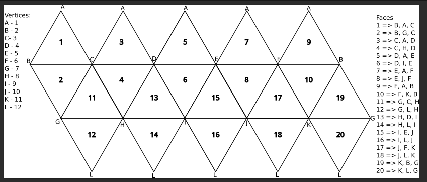

## Usage example for the projections

The `projection trait` has different methods, but at this point only two should be used outside of it.
The `geo_to_face`, in which you convert geographic coordinates to local 2D face coordinates and the face of the polyhedron, and the `face_to_geo` in which you do the inverse.

To call both these methods, with the projection to be used on a grid, you need three parameters:
- The latitude and longitude coordinates you want to project.
- The polyhedron or 3D shape to use (icosahedron, dodecahedron, etc).

Later on we will be adding, `geo_to_cartesian`, in which you convert geographic coordinates to cartesian coordinates and the `cartesian_to_geo` in which you do the inverse. Besides the parameters mentioned, another will be added:
- The 2D flat configuration.

The projection is independent of the polyhedron, this means that it allows the usage of another polyhedron on that same projection.

Example:

```rust
let position = PositionGeo {
    lat: 38.695125,
    lon: -9.222154,
};

// The projection which will be used
let projection = Vgc;

let result = projection.geo_to_face(vec![position], Some(&Icosahedron {}), &IcosahedronNet {});
```

The inverse will share the same behaviour.

To see in action, please run one of the examples:
```
cargo run --example basic
```

Each projection will be assigned a specific file.

## `Projection` trait
The `Projection` trait defines a unified interface for converting between geographic coordinates, polyhedral faces, cartesian layouts, and computing distortion metrics.  
It also provides helper routines for ellipsoidal latitude conversions and 3D coordinate transformation.

This trait allows multiple projection strategies to coexist behind a common API.
---

### 📦 Related Types

#### `Forward`
Represents the forward-projection result:

```rust
pub struct Forward {
    pub coords: Coord,
    pub face: usize,
    pub sub_triangle: u8,
}
```

### 📦 Methods
#### `geo_to_face(...) -> Vec<Forward>`
**Description:**  
Projects geographic coordinates (latitude/longitude) onto a specific face of a polyhedron.

**Parameters:**
- `positions`: A list of geographic positions (`geo::Point`) in degrees.
- `polyhedron`: Polyhedron definition to be used.

**Returns:**  
A vector of `Forward` structures, each containing the projected coordinates, face index, and the sub-triangle identifier.

---

#### `face_to_geo(&self, coords: Vec<Coord>) -> Point`
**Description:**  
Performs the inverse operation of `geo_to_face`, transforming 2D polyhedral face coordinates back into geographic coordinates.

**Parameters:**
- `coords`: Coordinates located on a polyhedron face.

**Returns:**  
A single `geo::Point` representing latitude and longitude.

---

#### `geo_to_cartesian(&self, positions: Vec<Point>, polyhedron: Option<&Polyhedron>, layout: &dyn Layout) -> Vec<Forward>`
**Description:**  
Projects geographic coordinates into a final cartesian output using a 2D layout derived from the polyhedron.

**Parameters:**
- `positions`: Vec of geographic coordinates.
- `polyhedron`: Polyhedron instance.
- `layout`: A layout strategy implementing the `Layout` trait, used to arrange faces in 2D space.

**Returns:**  
A list of `Forward` items corresponding to cartesian output coordinates.

---

#### `cartesian_to_geo(&self, coords: Vec<Coord>) -> Point`
**Description:**  
Converts cartesian coordinates (produced by a layout or projection) back into geographic latitude/longitude.

**Parameters:**
- `coords`: A vector of cartesian coordinates.

**Returns:**  
A single geographic point.

---

#### `compute_distortion(&self, lat: f64, lon: f64, polyhedron: &Polyhedron) -> DistortionMetrics`
**Description:**  
Computes a suite of distortion metrics at the given geographic location.

**Parameters:**
- `lat`: Latitude in radians.
- `lon`: Longitude in radians.
- `polyhedron`: The polyhedron used to compute face-level distortions.

**Returns:**  
A `DistortionMetrics` struct containing:
- `h`: horizontal scale factor  
- `k`: vertical scale factor  
- `angular_deformation`: local angular deformation  
- `areal_scale`: areal distortion factor  

---

#### `to_3d(lat: f64, lon: f64) -> [f64; 3]`
**Description:**  
Converts geographic coordinates into a 3D unit-sphere representation.

**Parameters:**
- `lat`: Latitude in radians.
- `lon`: Longitude in radians.

**Returns:**  
An array `[x, y, z]` representing a point on the unit sphere.

---

#### `lat_authalic_to_geodetic(latitude: f64, coef: &Vec<f64>) -> f64`
**Description:**  
Converts **authalic latitude → geodetic latitude** using a Fourier series with Clenshaw summation (Karney, 2023).

**Parameters:**
- `latitude`: Authalic latitude (radians).
- `coef`: Fourier coefficients.

**Returns:**  
Geodetic latitude corresponding to the same spherical area.

---

#### `lat_geodetic_to_authalic(latitude: f64, coef: &Vec<f64>) -> f64`
**Description:**  
Converts **geodetic latitude → authalic latitude** using the same coefficient and Clenshaw summation method.

**Parameters:**
- `latitude`: Geodetic latitude (radians).
- `coef`: Fourier coefficients.

**Returns:**  
Authalic latitude.

---

#### `fourier_coefficients(c: [f64; 21]) -> Vec<f64>`
**Description:**  
Generates a set of Fourier coefficients for latitude conversion using:

- WGS84 third flattening factor  
- Horner’s method for polynomial evaluation  
- 6-term expansion (minimum size for required accuracy)

**Parameters:**
- `c`: A 21-element table of constants used by Karney's method.

**Returns:**  
A vector of computed coefficients (`Vec<f64>`).

---

#### `apply_clenshaw_summation(latitude: f64, coef: &Vec<f64>) -> f64`
**Description:**  
Applies Karney’s 6th-order **Clenshaw summation** formula to compute corrected latitudes.

**Parameters:**
- `latitude`: Input latitude (radians).
- `coef`: Fourier coefficient vector.

**Returns:**  
Corrected latitude value.

**Notes:**  
Implements equation (33) from *Karney (2023)*.


### Notes:
- The method `compute_distortion` is used to measure the correctness and the area distortion of the projection (it will be useful if we need to get close to equal-areaness)


# `Polyhedron` — Method Documentation
A concrete polyhedron representation containing:
- Unit-sphere vertices  
- Face definitions  
- Pre-computed geometric data (centers, arc lengths, etc.)  
- Fast O(1) access to topology (faces, vertices, counts)
This design separates **data storage** from **geometric operations** for performance.

---

## 🏗️ `new(vertices, faces, num_edges) -> Self`

**Description:**  
Constructs a polyhedron while **precomputing**:
- Spherical centroids for each face  
- Vertex/face counts  

**Parameters:**
- `vertices`: A list of unit-sphere `Vector3D` vertices  
- `faces`: A list of `Face` objects (each holding vertex indices)  
- `num_edges`: Number of polyhedron edges

**Returns:**  
A fully constructed `Polyhedron` with precomputed fields.

---

## 🔍 Accessor Methods  
*(All return references — no allocations.)*

### `vertices(&self) -> &[Vector3D]`  
**Returns:** A slice of all vertices.

---

### `faces(&self) -> &[Face]`  
**Returns:** A slice of all faces.

---

### `face_centers(&self) -> &[Vector3D]`  
**Returns:** Precomputed spherical centroids of each face.

---

### `num_vertices(&self) -> usize`  
**Returns:** Total number of vertices.

---

### `num_edges(&self) -> usize`  
**Returns:** Total number of edges.

---

### `num_faces(&self) -> usize`  
**Returns:** Total number of faces.

---

# 🧮 Geometry and Topology Operations
## `face_center(&self, face_id: usize) -> Vector3D`
**Description:**  
Returns the precomputed center of a face in **O(1)**.

**Parameters:**
- `face_id`: Index of the face

**Returns:**  
A normalized `Vector3D` pointing to the spherical centroid.

---

## `find_face(&self, point: Vector3D) -> Option<usize>`
**Description:**  
Determines which face contains the given point on the unit sphere.

Uses **spherical triangle containment testing** for each face.

**Parameters:**
- `point`: A point on the unit sphere

**Returns:**  
- `Some(face_id)` if a containing face is found  
- `None` otherwise

---

## `face_vertices(&self, face_id: usize) -> Option<Vec<Vector3D>>`
**Description:**  
Retrieves the vertices forming the given face.

**Parameters:**
- `face_id`: Index of the face

**Returns:**  
A `Vec<Vector3D>` of the face’s vertices, or `None` if invalid.

---

## `face_arc_lengths(&self, face_id: usize) -> Option<Vec<f64>>`
**Description:**  
Computes spherical **arc lengths** between consecutive vertices of a face.

Each arc length is computed using  
`spherical_geometry::stable_angle_between`.

**Parameters:**
- `face_id`: Index of the face

**Returns:**  
A vector of side lengths for the face, or `None`.

---

## `arc_lengths(&self, triangle: [Vector3D; 3], point: Vector3D) -> ArcLengths`

**Description:**  
Computes arc lengths between:
- Triangle vertices `(corner, mid, center)`  
- The point `p`  
This is often used for **distortion metrics** or **local interpolation**.

**Parameters:**
- `triangle`: A 3-vertex spherical triangle  
- `point`: A point on the sphere

**Returns:**  
An `ArcLengths` struct containing:
- `ab`, `bc`, `ac` — triangle side lengths  
- `ap`, `bp`, `cp` — distances from point to vertices

---

## `is_point_in_face(&self, point: Vector3D, face_id: usize) -> bool`
**Description:**  
Checks whether a point lies **inside** the given face using spherical triangle containment.

**Parameters:**
- `point`: Unit-sphere point  
- `face_id`: Face index

**Returns:**  
`true` if the point is inside the face, `false` otherwise.

---

## `are_faces_adjacent(&self, face1: usize, face2: usize) -> bool`
**Description:**  
Determines whether two faces share an edge.  
Faces are adjacent if they share **exactly 2 vertices**.

**Parameters:**
- `face1`: Index of the first face  
- `face2`: Index of the second face

**Returns:**  
`true` if the faces share exactly two vertices; otherwise `false`.

**Notes:**
- Uses an epsilon tolerance (`1e-10`) for floating-point comparison.


## Polyhedron
### Icosahedron
The icosahedron is laid out on the unit sphere with two vertices being on the poles, and the rest being spread across the equator. Here's a representation in 2D space of the icosahedron:


## Projections
### Vertex Great Circle (van Leeuwen or slice-and-dice projection)
This projection comes from this [article](https://www.tandfonline.com/doi/abs/10.1559/152304006779500687). The projection divides the face of the polyhedron into equilateral triangles by the number of existente vertices, and splits those triangle in two rectangle triangles. From there it finds the point in of those two triangles, and "slices" it to get a point D on the opposite side of the triangle, then it "dices" to get the point P from D. To explain it further what is happening in the code, here's the following:

1. We get the fourier coefficients for the authalic latitude.
2. Loop through every position.
    a. Convert to authalic latitudes.
    b. Loops through all faces in the polyhedron
        * Finds the face where the point lies
        * Splits the face into equilateral triangles from the center, finds in which the triangle where the point is. Then splits that triangle into two rectangular triangles and finds in which rectangular triangle the point lies 
        * Calculate arc lengths for the triangle and maps into 2D in a local 2D system. A => (0,0) B => (BA,0) C => (BC*cos(angle_B), BC*sin(angle_B))
        
        * Get spherichal angles for point B and C
        * Apply slice and dice formulas and gets the `uv` and `xy` parameterization.
        * Interpolate for point D
        * interpolate for point P
3. Return array with 2D local coordinates (origin on the sub-triangle), face of the polyhedron, and the sub-triangle.

NOTE: The compute_distortion method will be used eventually so we can assess if the distortion parameters (The Tissot Indicatrix parameters) match the ones with the author values.

#### Tests
- Testing point creation
- Testing geographic coordinates to barycentric
- Testing if the points have spatial consistency (this mean if the point is correct)
- Testing if point hit the north pole
- Testing if point falls in the equator

