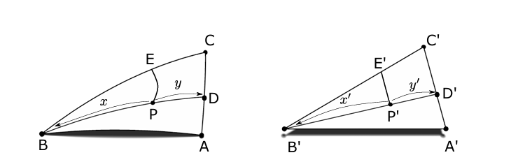

## Usage example for the projections

The `projection trait` has different methods, but only two should be used outside .
The `geo_to_bary`, in which you convert geographic coordinates to local barycentric coordinates and the `bary_to_geo` in which you do the opposite.
The `geo_to_cartesian`, in which you convert geographic coordinates to cartesian coordinates and the `cartesian_to_geo` in which you do the opposite.

To call both these methods, with the projection to be used on a grid, you need three parameters:
- The latitude and longitude coordinates you want to project.
- The polyhedron or 3D shape to use (icosahedron, dodecahedron, etc).
- The 2D flat configuration.

The projection is independent of the polyhedron, this mean that it allows utilization of another polyhedron on that same projection.

Example:

```rust
let position = PositionGeo {
    lat: 38.695125,
    lon: -9.222154,
};

// The projection which will be used
let projection = Vgc;

let result = projection.forward(vec![position], Some(&Icosahedron {}), &IcosahedronNet {});
```

The inverse will share the same behiaviour.

Each projection will be assigned a specific file.

## Things to consider
- The `trait` has authalic to geodetic conversion (and vice-versa), so the project is quite accurate in terms of representating spatial relationships from an equal-area standpoint. The methods `lat_authalic_to_geodetic`, `lat_geodetic_to_authalic`, `fourier_coefficients`, `apply_clenshaw_summation` are all used in these process, being that the first two are the ones called for the conversion.
- There is a method called `to_3d` which allows calculating a 3D unit vector from a latitude/longitude of a given point P.

## Projections
### Vertex Great Circle (van Leeuwen or slice-and-dice projection)
This projection comes from this [article](https://www.tandfonline.com/doi/abs/10.1559/152304006779500687). The projection divides the face of the polyhedron and splits it in rectangle triangles, from there it "slices" the triangle to get a point D on the opposite side of the triangle, then it "dices" to get the point P from D. To explain it further what is happening in the code, here's the following:

1. We get the fourier coefficients for the authalic latitude.
2. Loop through every position.
    a. Convert to authalic latitudes.
    b. Loops through all faces in the polyhedron
        * Finds the face where the point lies
        * Slits the face into rectangular triangles and finds in triangle the point lies 
        * Calculate arc lengths for triangle and maps into 2D in a local barycentric system. A => (0,0) B => (BA,0) C => (BC x cos(angle_B), BC x sin(angle_B))
        
        * Get sperichal angles for point B and C
        * Apply slice and dice formulas and get `uv` and `xy` parameterization
        * Interpolate for point D
        * interpolate for point P
3. Return array with barycentric local coordinates, face of the polyhedron, and the sub-triangle.

NOTE: The splitting of the triangles only works for the icosahedron, this will be changed in later PRs. The compute_distortion method will be used here so we can assess if the distortion parameters (The Tissot Indicatrix parameters) match the ones with the author values.

#### Tests
- Testing point creation
- Testing geographic coordinates to barycentric
- Testing if the points have spatial consistency (this mean if the point is correct)
- Testing if point hit the north pole
- Testing if point falls in the equator